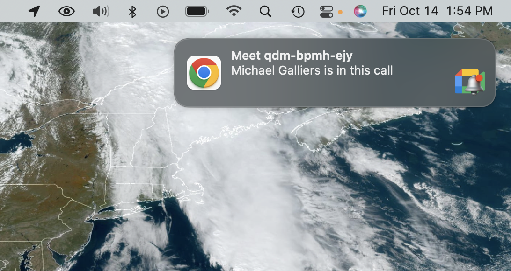

# Google Meet Monitor - Chrome Extension

  

  
  
   
  Get notifications of who's in a Google Meet meeting

## Features

- Open a Google Meet waiting room in Chrome and get notified when someone joins/drops.
- Works with multiple Google Meet meeting at the same time.
- Automatically clicks "Keep waiting" when prompted to ensure you aren't kicked from the waiting room.

Note that each Google Meet window must not be minimized for notifications to work properly.

## Copyright

Copyright (c) 2022 KDP Software Development. All Rights Reserved.

## Connect with [KDP Software](https://kydronepilot.com)

  <a href="https://kydronepilot.com">kydronepilot.com</a>
  | <a href="https://twitter.com/kdp_dev">Twitter</a>
  | <a href="https://www.linkedin.com/company/kdp-software/">LinkedIn</a>
  | <a href="https://www.youtube.com/channel/UCOKUOMU1cSvcgnyga8atl-g">YouTube</a>
  | <a href="https://www.instagram.com/kdp_software/">Instagram</a>

